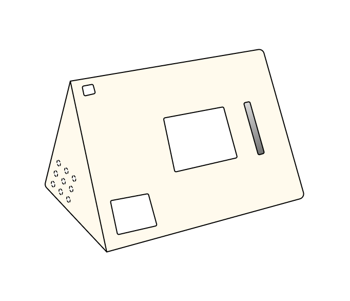
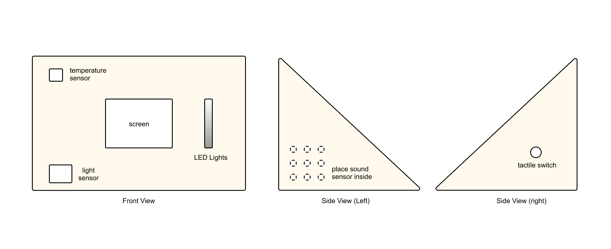
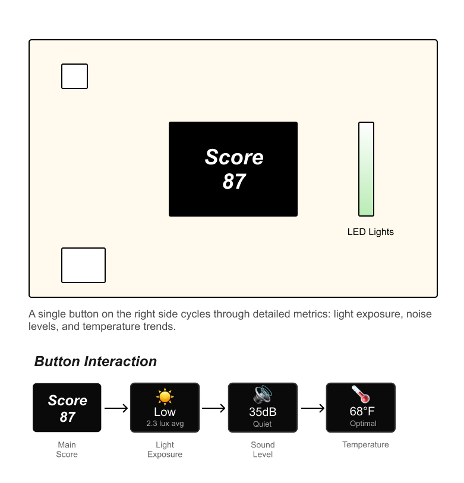
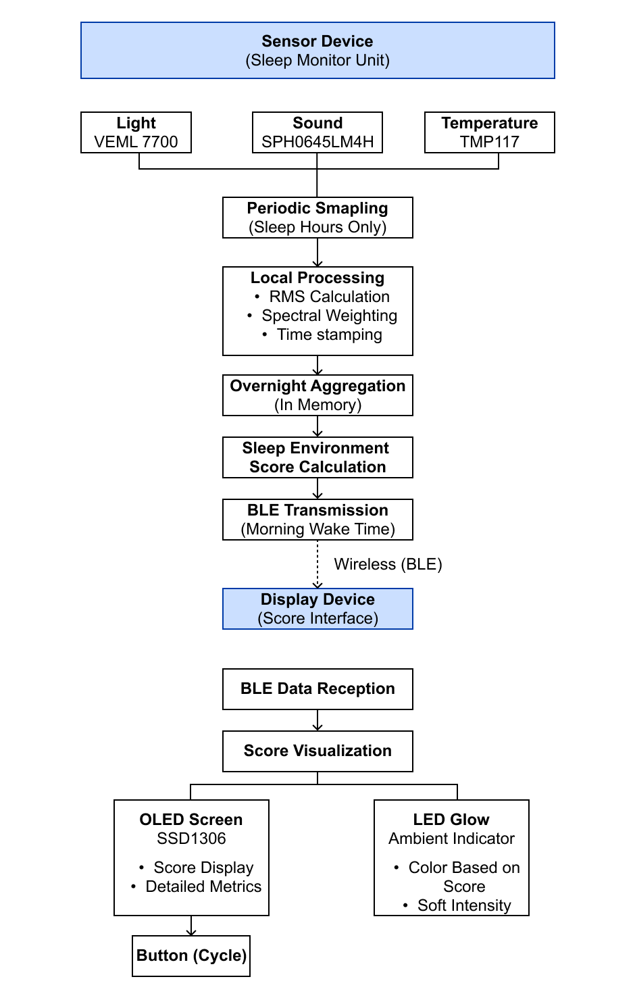

## Sleep Environment & Recovery Monitor
### Project Overview
#### What it does

The Sleep Environment & Recovery Monitor evaluates overnight sleep conditions — light, sound, temperature — and translates them into a simple, physical recovery score visible in the morning. Instead of tracking the body, the system focuses on environmental quality to encourage healthier sleep habits without medical claims.

#### What it looks like

The system consists of two devices:
* A sensor unit placed on a nightstand that quietly monitors the sleep environment overnight (light, sound, temperature)
* A display unit resembling a small alarm clock with an OLED screen, LED indicator, and a stepper-motor-driven gauge needle that physically points to your sleep quality score

### Sensor Device (Sleep Environment Monitor)
#### Description
The sensor device continuously monitors environmental conditions during sleep using a low-power duty cycle. Data is aggregated overnight and transmitted wirelessly to the display device in the morning.

#### Sensors & Parts (part numbers)
| Function | Part Number | Quantity | Description |
|---------|------------|----------|-------------|
| MCU + Wireless| Seeed Studio XIAO ESP32-C3| 1 | BLE, low power |
| Ambient Light Sensor | VEML7700 | 1 | High-sensitivity ambient light sensor (I²C) |
| Microphone | SPH0645LM4H-B | 1 | I²S MEMS microphone, RMS only |
| Temperature | TMP117 | 1 | High-accuracy temperature sensing |
| Battery Charger | MCP73831 | 1 | LiPo charging IC |
| LiPo Battery | 3.7V 1000-2000mAh | 1 | Power supply |

#### How it works
- The device wakes on a scheduled interval during sleep hours.
- Light, sound RMS, temperature are sampled.
- Audio is processed locally (no recording or storage).
- All data is time-weighted and stored in local memory.
- At wake time, a summary packet is transmitted to the display device.

### Display Device (Score Interface)
#### Description
The display device receives environmental data wirelessly and presents the overnight Sleep Environment Score using multiple feedback channels: a physical gauge needle, OLED screen, and ambient LED indicator. A single button allows the user to cycle through secondary metrics such as light exposure, noise level, and temperature.

#### Components & Parts
| Function | Part Number | Quantity | Notes |
|---------|------------|----------|------|
| MCU + Wireless | Seeed Studio XIAO ESP32-C3 | 1 | Wireless receiver |
| Display | SSD1306 OLED (128×64) | 1 | Low-power I²C screen |
| Stepper Motor | 28BYJ-48 (5V)        | 1 | Drives gauge needle        |
| Motor Driver  | ULN2003 Driver Board | 1 | Stepper motor driver       |
| Gauge Needle  | Custom (3D printed)  | 1 | Physical pointer (0-100)   |
| LED | Warm White Diffused LED | 1 | Ambient sleep quality indicator |
| Button | Tactile Momentary Switch | 1 | Metric navigation |
| Battery | LiPo 2000 mAh | 1 | Multi-day operation |
| Resistor | 220Ω | 1 | LED current limiting |

#### Gauge Needle Design

Scale: 0-100 (semi-circular arc)

Zones:
- 0-50: Red zone (Poor)
- 50-70: Orange zone (Fair)
- 70-90: Yellow zone (Good)
- 90-100: Green zone (Excellent)

### System Communication & Data Flow

*Figure: Complete data pipeline from sensors through processing to display outputs.*

#### System Communication
The system consists of two standalone devices that communicate wirelessly:

Sensor Unit (Transmitter):
- Operates independently overnight
- Collects and aggregates environmental data
- Transmits single summary packet in the morning

Display Unit (Receiver):
- Listens for BLE transmission from sensor unit
- Receives aggregated data and calculated score
- Updates three output channels: gauge needle, OLED, LED

Communication Protocol:
- Technology: BLE
- Pairing: One-time setup, devices remember each other
- Data Format: JSON or binary packet containing:
  - Overall score (0-100)
  - Average light level (lux)
  - Average sound level (dB RMS)
  - Average temperature (°F/°C)
  - Timestamp

#### Data Flow & Processing Pipeline

During Sleep Period:
1. Sensor device periodically samples ambient light, sound level, and temperature
2. Audio data is processed locally using RMS calculation and basic spectral weighting to emphasize disruptive noise patterns
3. All sensor readings are time-weighted (e.g., disruptions during REM sleep weighted higher)
4. Data is aggregated into a single overnight dataset

Morning Transmission:
1. Aggregated data is converted into a normalized Sleep Environment Score (0-100)
2. Score and detailed metrics are packaged into BLE transmission packet
3. Sensor unit broadcasts packet to display unit
4. Display unit receives data and updates all feedback channels

Physical Feedback:
- Gauge Needle: Stepper motor positions needle to corresponding score (0-100 scale)
- OLED Screen: Displays numeric score and allows cycling through detailed metrics
- LED Indicator: Glows with color corresponding to quality zone (green/yellow/orange/red)

### Future Work
- Optional Wi-Fi connectivity to support long-term data logging or remote visualization